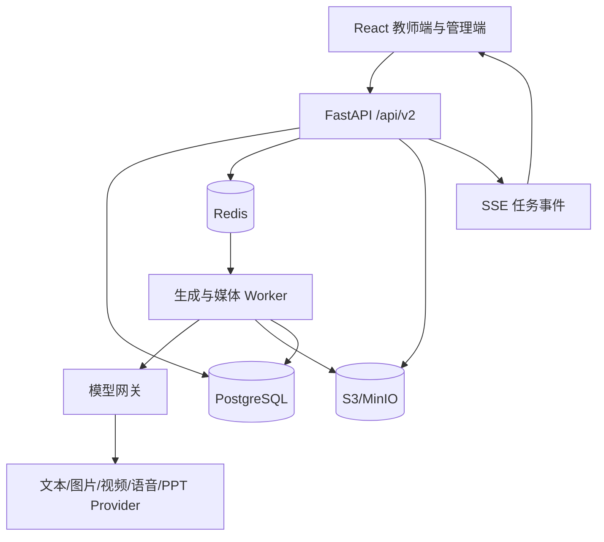

# 后端构建蓝图

## 1. 结论

后端采用“模块化单体 API + 独立异步 worker + 统一模型网关”，不从零重写，也不在 MVP 阶段拆成大量微服务。

现有 `DOIT-Ben/shanhaiedu-v1.0.0` 已经具备可复用的 FastAPI 基座，包括项目、状态、版本、任务、产物、认证、Prompt registry、工作流配置和多类 Provider adapter。新仓库应迁入并收敛这些能力，逐步将 SQLite 和本地文件实现替换为 PostgreSQL、Redis 和对象存储。

## 2. 目标拓扑



## 3. 推荐技术栈

| 领域 | 选型 | 原因 |
|---|---|---|
| API | Python 3.12 + FastAPI | 与现有基座一致，适合多模型适配和异步 I/O |
| 数据模型 | Pydantic v2 | 请求、事件、Prompt 参数和工作流 Schema 统一校验 |
| ORM | SQLAlchemy 2 | 保留数据库可迁移性，支持 PostgreSQL |
| 数据迁移 | Alembic | 所有 Schema 变化可追踪、可回滚 |
| 主数据库 | PostgreSQL 16 | 项目、节点、版本、任务、审计和费用的运行真源 |
| 缓存/队列 | Redis 7 | 分布式锁、速率限制、任务队列和事件中转 |
| Worker | Dramatiq + Redis | 比完整 Celery 更轻，满足重试、延迟任务和多队列 |
| 文件 | S3 兼容存储，开发用 MinIO | 教材、图片、视频、PPTX、DOCX 与导出包统一管理 |
| 媒体处理 | FFmpeg/ffprobe | 片段校验、转码、拼接、音轨与封面处理 |
| 观测 | OpenTelemetry + Sentry + Prometheus | 串起请求、任务和 Provider 调用，支持告警与费用追踪 |
| API 合同 | OpenAPI 3.1 + JSON Schema | 前后端生成类型并进行合同测试 |

## 4. 代码结构

```text
apps/api/app/
  api/v2/                 路由和请求响应 DTO
  core/                   配置、认证、错误、日志、幂等
  modules/
    projects/             项目与课例
    textbooks/            教材上传、解析、引用
    lesson_plans/         课时划分、教案、三类九套导入设计
    workflows/            DAG、节点状态、推进策略
    prompts/              模板、变量、版本、最终提示词
    assets/               文件、引用、版本、派生关系
    generations/          生成任务与运行记录
    deliveries/           教案、PPTX、视频和交付包
    model_gateway/        Provider、模型、路由、密钥引用和健康状态
    admin/                模板、工作流、权限、审计、用量
  providers/              Provider adapter 实现
  repositories/           SQLAlchemy repository
  events/                 领域事件和 SSE 映射
workers/
  generation/             文本、图片、视频、TTS、PPT
  media/                  FFmpeg、校验、合成和缩略图
  export/                 DOCX、PPTX、ZIP 导出
workflow/
  definitions/            版本化工作流 DAG
  schemas/                节点输入输出 Schema
  prompts/                Prompt 模板和默认策略
  validators/             数学、格式、资产和安全校验
```

路由只做鉴权、校验和调用应用服务；Provider 逻辑不得写进路由。工作流、模型网关和资产服务通过稳定接口协作，不互相读取私有表。

## 5. 核心领域模型

| 对象 | 关键字段与职责 |
|---|---|
| project | 教师课例、学科、年级、教材、运行模式、当前节点 |
| workflow_definition | 工作流模板、版本、节点、依赖、跳过条件和推进规则 |
| workflow_run | 某项目绑定的不可变工作流版本与运行状态 |
| node_run | 节点状态、尝试次数、当前输入/输出版本、审核人与时间 |
| prompt_template | 模板正文、变量 Schema、适用节点、版本、发布状态 |
| prompt_snapshot | 一次运行实际发送的最终提示词和模型参数，不随模板更新改变 |
| generation_job | 幂等键、队列、Provider、状态、重试、费用、追踪 ID |
| asset | 文件元数据、对象键、类型、校验和、尺寸/时长、所有者 |
| asset_relation | 输入、输出、参考、首帧、母图、片段和成品之间的派生关系 |
| artifact_version | 教案、PPT、脚本、分镜和视频的业务版本 |
| approval | 教师确认、驳回、返修原因和确认时采用的版本 |
| provider_config | 能力、模型、Base URL、密钥引用、限流、启停和健康状态 |
| usage_record | Token、图片数、视频秒数、费用、Provider 与业务归属 |
| audit_log | 谁在何时修改了模板、路由、密钥引用、状态或资产 |

所有下游节点引用上游的“已确认版本 ID”，不能只复制一段易失文本。上游确认版本发生改变时，系统标记下游为 `stale`，由教师决定继续使用旧版本还是重新生成。

## 6. 工作流引擎

### 状态

统一对外状态：

```text
not_started -> ready -> running -> review_required -> approved
                       |             |                 |
                       v             v                 v
                     failed       revising           stale
```

另有 `skipped`、`cancelled`、`partially_succeeded`。内部 Provider 状态只映射到这些业务状态，不直接暴露给教师。

### 推进模式

- 手动：每个生成节点都由教师点击开始和确认。
- 半自动：系统准备下一节点的默认输入和提示词，教师确认后提交模型。
- 全自动：在已授权的节点范围内自动提交和推进；遇到硬门禁、费用门槛、失败或必须审批节点立即暂停。

三个模式共用同一 DAG 和状态机，不能各写一套流程。

### 幂等与恢复

- 创建项目、启动任务、Provider 回调和确认操作都要求幂等键。
- 前端断线不影响任务；任务状态以数据库为准。
- Worker 采用租约和心跳，超时任务可回收。
- Provider 轮询与回调必须去重；重复回调不得重复计费或生成资产。
- 重试产生新的 attempt，但保留原始失败证据。

## 7. 模型网关

模型网关不是一个具体模型，而是系统对所有模型能力的统一调用层。

### 标准能力接口

- `generate_text`
- `generate_image`
- `generate_video`
- `synthesize_speech`
- `generate_presentation`
- `embed`（预留）

### 每次调用必须记录

- 项目、节点、用户、Prompt snapshot 和输入资产版本。
- 逻辑模型和实际 Provider/model。
- 参数、状态、耗时、重试、Token/数量/秒数与估算费用。
- 脱敏后的上游请求摘要和响应摘要。
- 输出资产和派生关系。

### 路由规则

按“能力 -> 场景 -> 租户/项目策略 -> Provider 配置”选择模型。MVP 先支持管理员显式配置主模型，不做复杂自动竞价；失败回退必须由节点策略允许，并把实际使用模型展示给管理员。

### 密钥

数据库只保存 `secret_ref`，密钥值由部署环境、Vault 或云密钥管理系统提供。管理端只能测试连接、轮换引用和查看尾号，不能读取明文。

## 8. 资产与文件链路

1. 前端请求上传会话。
2. 后端进行权限和配额校验，返回预签名上传地址。
3. 浏览器直传对象存储。
4. 后端完成确认、MIME/魔数/大小/校验和检查并创建资产记录。
5. PDF/DOCX 解析、缩略图和媒体探测通过 worker 异步完成。
6. 下游只传 `asset_id`，不传本地路径和任意外部 URL。

正式资产必须具备 SHA-256、MIME、大小、所有者和可追溯来源。删除项目采用软删除和异步回收，避免误删正在被版本引用的文件。

## 9. API 与事件

- 浏览器业务 API 使用 `/api/v2`。
- 长任务启动返回 `202 + job_id`。
- 状态通过 `GET /jobs/{id}` 和 `GET /events/stream` 提供。
- SSE 事件至少包含 `event_id`、`project_id`、`node_id`、`job_id`、`status`、`progress`、`occurred_at` 和安全的用户文案。
- 支持 `Last-Event-ID` 恢复；SSE 断线后前端回退为低频轮询。
- 错误统一返回 `code/message/retryable/details/request_id`，不得把 Provider 密钥、堆栈和内部路径返回浏览器。

## 10. 部署阶段

### 本地和联调

Docker Compose：API、worker、PostgreSQL、Redis、MinIO。模型可使用显式 fake provider，但界面必须清楚标识为模拟环境。

### 内测生产

- API 与 worker 分容器部署。
- PostgreSQL、Redis 和对象存储使用托管服务。
- 媒体 worker 使用可挂载临时磁盘的计算节点。
- Provider 调用设置租户级和模型级限流。
- 每日数据库备份、对象版本控制和恢复演练。

### 扩展条件

只有在一个模块出现独立伸缩、独立发布或故障隔离的明确证据时才拆服务。优先可能拆出的模块是媒体合成和模型任务执行，不先拆项目、Prompt 或审批服务。

## 11. MVP 后端完成定义

固定一个真实小学数学课例，必须完成：

1. 上传教材并形成可追溯解析结果。
2. 划分课时并生成每课时十二段式教案。
3. 生成三类九套导入设计并保存锚点选择。
4. 生成和保存最终提示词、输出与版本。
5. 完成 PPT 分支和导入视频分支的资产流转。
6. 图片进入细分镜并生成可重试的视频片段。
7. 合成可播放的视频并与教案、PPTX 一起交付。
8. 刷新、退出、失败重试后状态和资产不丢失。
9. 管理员能配置模型路由、模板版本并查看脱敏运行记录。
10. 真实模型调用、费用、错误和产物可审计，不用占位内容冒充完成。
