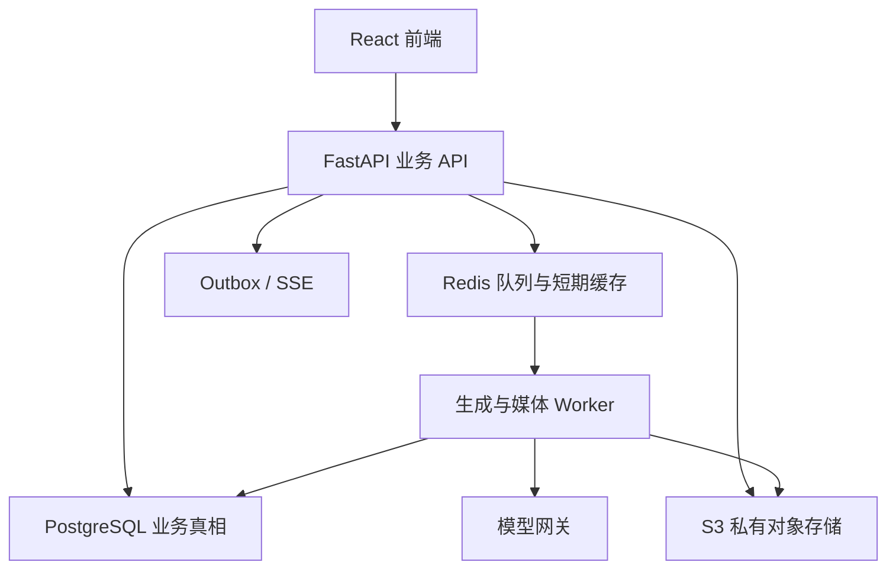

# 系统架构

## 1. 架构目标

系统首先闭环小学数学课件生产，同时为其他学科和创作能力预留扩展点。首期采用模块化单体，是为了在业务规则仍快速演化时保持事务一致性和开发效率；耗时、多模态和媒体处理通过 Worker 横向扩容。

## 2. 部署单元

| 部署单元 | 职责 | 可扩展方式 |
| --- | --- | --- |
| `web` | FastAPI、鉴权、业务命令、查询、SSE | 无状态横向扩展 |
| `worker-text` | 文本模型、结构化输出、内容校验 | 按队列和并发扩展 |
| `worker-image` | 生图任务、回调、质量检测 | 按供应商限流扩展 |
| `worker-video` | 图生视频、候选片段、回调 | 按供应商限流扩展 |
| `worker-media` | PDF/PPTX 渲染、FFmpeg 合成、缩略图 | CPU/GPU 独立扩展 |
| `scheduler` | 超时扫描、重试、保留期清理、用量汇总 | 单活加租约 |
| PostgreSQL | 所有可恢复业务状态 | 主从、备份、PITR |
| Redis | 队列、锁、短缓存、限流 | 不承载唯一业务状态 |
| S3 | 上传原件、生成文件、预览和交付物 | 开启版本和生命周期 |

首期可把各类 Worker 部署成同一镜像的不同启动命令，但队列和并发必须隔离，防止视频任务阻塞文本生成。

## 3. 模块边界

后端建议采用 `src/shanhai/<module>` 目录。模块之间只通过应用服务、领域事件或公开查询接口协作，禁止跨模块直接修改私有表。

| 模块 | 核心职责 |
| --- | --- |
| `identity` | 用户、组织、成员、角色、会话 |
| `projects` | 项目、课时、分支开关、成员权限 |
| `materials` | 教材上传、解析、OCR、页段引用 |
| `content_runtime` | 内容包、结构定义、提示词编译、锚点与规则 |
| `workflows` | 工作流定义、运行实例、节点状态、自动化策略 |
| `artifacts` | 可编辑产物、草稿、不可变版本、依赖关系、审核 |
| `assets` | 文件资产、版本、项目资产槽位、授权访问 |
| `creation` | 创作包、批次、生成任务、候选结果、保存回项目 |
| `lesson_plans` | 课时划分、教案语义规则和校验 |
| `ppt` | 大纲、页级设计、风格合同、渲染和 PPTX 导出 |
| `video` | 故事、粗细分镜、镜头、片段、音频、合成 |
| `model_gateway` | 逻辑模型、供应商适配、路由、重试、计量 |
| `deliveries` | 交付清单、打包、下载权限和保留期 |
| `admin` | 内容发布、工作流发布、模型配置、审计和成本 |

## 4. 分层约束

每个模块遵循四层：

- `domain`：实体、值对象、状态机和纯业务规则，不依赖 FastAPI、Dramatiq 或供应商 SDK。
- `application`：用例、事务边界、权限判断、幂等和领域事件。
- `infrastructure`：SQLAlchemy 仓储、S3、Redis、模型供应商、FFmpeg 等适配器。
- `interfaces`：REST、SSE、Worker 消费者、回调入口。

API 路由不能直接操作 ORM；Worker 不能绕过应用服务更新业务状态；模型供应商返回值不能直接成为领域对象，必须经适配、校验和持久化。

## 5. 同步与异步边界

下列操作同步完成：创建项目、保存草稿、编辑结构、审核、创建生成任务、查询状态。单次 HTTP 请求不等待外部模型、渲染或媒体合成。

异步任务采用以下可靠链路：

1. API 在一个数据库事务中写业务记录和 `outbox_events`。
2. 发布器把 Outbox 事件投递到 Redis 队列。
3. Worker 以租约领取任务，持久化每次尝试。
4. Worker 更新数据库并写新 Outbox 事件。
5. SSE 服务从事件流向前端推送；断线后前端可用游标补取。

队列消息只携带 ID 和幂等键，不能携带唯一业务真相。

## 6. 文件与媒体边界

- 浏览器通过预签名地址直传对象存储，API 只负责创建上传会话和确认。
- 原始上传、标准化文件、预览图、缩略图、候选结果和最终交付物使用不同 `asset_kind`。
- 对象键由后端生成，禁止直接使用用户文件名作为路径。
- 文件下载默认短期签名地址；项目权限变化后不延长旧地址。
- PDF、Office、图片和视频处理均在隔离 Worker 内进行，设置超时、大小和页数限制。

## 7. 可观测性与成本

所有请求、节点运行和生成任务贯穿 `request_id`、`workflow_run_id`、`node_run_id`、`generation_job_id`。日志不得写入完整提示词、学生个人信息、模型密钥或长期签名地址。

关键指标包括：

- 节点等待、运行和人工审核时长；
- 各逻辑模型成功率、P95 延迟、重试率和熔断状态；
- 文本 token、图片张数、视频秒数、存储和媒体计算成本；
- 自动化暂停原因、结构校验失败率、保存回项目失败率；
- SSE 在线数、事件积压、Outbox 延迟和 Worker 队列深度。

## 8. 不采用的方案

- 不在首期拆成大量微服务；领域边界先在代码和数据访问层落实。
- 不用前端状态或 Redis 代表项目进度。
- 不把整条业务链写成一个队列任务链；节点状态必须可单独审核、重跑和替换输入。
- 不把提示词硬编码在 Python 文件里；它们属于受版本管理的业务内容。
- 不让供应商任务 ID 成为系统主键；供应商可替换，系统 ID 必须稳定。
