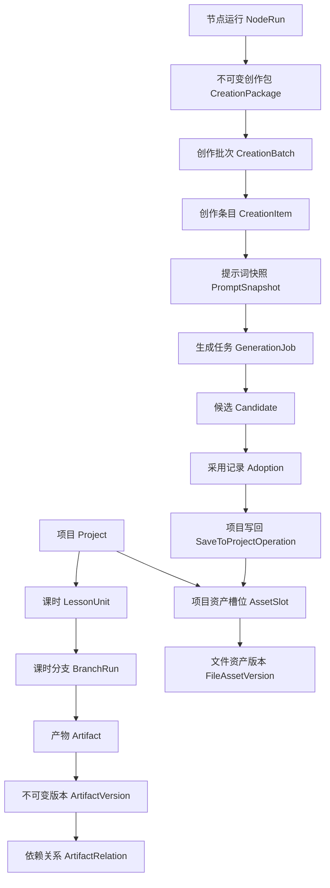

# 领域模型与资产版本

## 1. 聚合边界

`Project` 是项目事务边界，`Artifact` 是内容演进边界，`CreationBatch` 是通用创作边界。创作候选结果在保存前不属于项目。

## 2. 项目与课时

### Project

一个项目对应一次“小学数学单知识点课件生产”。核心字段包括学段、年级、教材版本、知识点标题、默认语言、当前内容发布版本和状态。

项目状态：`draft`、`active`、`archived`。项目归档不删除任何已批准版本或交付物。

### LessonUnit

教材可拆出多个课时。课时拥有稳定 `lesson_key`、顺序、名称、目标摘要、预计时长和状态。课时划分被批准后，新增、删除或重排课时必须产生新版划分产物并触发精确影响分析。

### LessonBranchConfig

每课时至少包含 `lesson_plan`，并可独立启用 `ppt`、`video`。关闭分支意味着工作流将相应节点置为 `disabled`，不代表删除历史产物。

三类九套导入设计不是视频分支中的临时数据，而是课时级 `intro_option_set` 产物。它默认启用并可作为教案附录导出；教师明确不要时可以关闭。方案选择使用独立 `IntroSelection`，不修改方案集版本。

## 3. 产物三层模型

### Artifact

表示项目内一个稳定的逻辑产物，例如“第 2 课时当前教案”“第 2 课时三类九套导入设计”“PPT 第 5 页设计稿”“视频第 3 镜头细分镜”。关键字段是稳定 `artifact_key`、类型、归属项目/课时/分支和当前批准版本引用。

### ArtifactDraft

用户正在编辑的可变工作副本。支持自动保存、乐观锁和字段级校验。同一产物同一编辑分支原则上只有一个活动草稿。

### ArtifactVersion

每次生成、提交审核或批准都落为不可变版本，保存结构化内容、渲染摘要、来源、创建者和校验结果。批准不会修改版本内容，只新增审核记录并更新 `Artifact.current_approved_version_id`。

禁止：

- 原地修改已提交或已批准版本；
- 用一个 JSON 字段覆盖整个历史；
- 仅保存最新提示词，不保存生成该版本时的上下文和模型信息。

## 4. 文件资产与项目资产槽位

### FileAsset / FileAssetVersion

`FileAsset` 是稳定文件身份；`FileAssetVersion` 指向一个具体对象存储对象，并记录 MIME、大小、哈希、尺寸、时长、页数、检测状态和派生来源。替换图片或视频必须创建新版本。

### ProjectAssetSlot

槽位用稳定语义键表达“项目需要什么”，例如：

- `lesson.02.plan.approved`
- `lesson.02.ppt.page.05.preview`
- `lesson.02.video.shot.03.keyframe`
- `lesson.02.video.shot.03.clip.selected`
- `lesson.02.delivery.video.final`

前端和工作流引用槽位，不直接把某个供应商 URL 当成长期业务引用。

### AssetBinding

把文件资产版本绑定到槽位，并记录来源结果、保存操作和是否为当前活动绑定。单值槽位只能有一个活动绑定；候选集槽位可配置多值和排序。

## 5. 依赖、来源与过期

`ArtifactRelation` 记录版本到版本的语义依赖，关系至少包括：

- `derived_from`：由上游内容生成；
- `references`：生成或编辑时引用；
- `renders`：结构化产物渲染为文件；
- `selects`：从候选中选定；
- `supersedes`：新版本替代旧版本。

每个版本还要保存 `ContextSnapshot` 和 `PromptSnapshot`。当上游产生新批准版本时，只沿真实依赖边把仍基于旧批准版本的下游标记为 `stale`；用户手工创建但未引用该上游的内容不能被误伤。

`stale` 是“需要复核或重生成”，不是自动删除。用户可以：重新生成、保留并确认、修改依赖、关闭分支。

## 6. 审核模型

`Approval` 独立于产物版本，包含动作、意见、结构校验结果、质量分、审核者和时间。动作统一为：

- `submit`：提交审核；
- `approve`：通过并成为当前批准版本；
- `request_changes`：退回草稿；
- `revoke`：撤销批准，需高权限和原因；
- `accept_stale`：确认沿用过期版本。

自动化审核使用系统身份，但仍必须写审核记录、策略版本和质量证据。

## 7. 导入方案选择

`intro_option_set` 的版本包含九套完整方案。独立创意生成时保存一份禁止课程上下文的 `ContextSnapshot`；最小课程锚定使用另一份只允许课时范围和教材证据的快照。最终版本能证明两阶段没有混用上下文。

`IntroSelection` 引用一个已批准方案集版本和其中稳定 `option_key`，记录 `teacher_selected` 或 `policy_default`、选择者、推荐度证据和时间。修改选择新增记录并让旧选择失效，不回写方案集或教案。

创建视频项目时，把当前选择复制为不可变 `selected_intro_snapshot`。之后方案集或选择变化只把视频标记为可复核，不静默改写正在制作的故事与片段。

## 8. 创作中心领域模型

### CreationPackage

由项目节点导出的不可变输入包，包含来源项目、工作流运行、节点运行、结构化提示词、资产引用、目标槽位、风格合同和保存规则。包生成后不可编辑，修改需求需创建新包。这样才能证明“创作时实际拿到的输入”，并防止项目模式在生成或写回时改换目标。

### CreationBatch

创作中心中的可编辑会话，必须通过`source_kind`区分：

- `project`：必须由`CreationPackage`创建，并继承`project_id`、`workflow_run_id`、`source_node_run_id`和固定目标槽位；
- `standalone`：完全独立创建，不得伪造项目、工作流或节点来源。

批次内有一个或多个`CreationItem`；每个条目保存用户修改历史、当前业务提示词和引用资产。

### PromptDraft / PromptSnapshot

教师修改的是业务`PromptDraft`。执行`save_prompt_version`后形成不可变提示词版本；执行`generate`时再把该版本、上下文、参考资产、逻辑模型档位和安全层冻结为`PromptSnapshot`。保存提示词版本不触发生成，运行中继续编辑只影响下一次生成。

### Candidate / Adoption

模型返回的每个`Candidate`由独立`GenerationResult`承载，拥有预览资产、质量信号、服务端供应商元数据和状态。`Adoption`单独记录用户或策略采用了哪个候选、理由和策略快照；采用不改变候选文件事实，也不等于已进入项目。

### SaveToProjectOperation

把已采用候选正式写入项目时产生。项目来源批次只能使用创作包固定的来源项目和目标槽位；独立来源批次必须显式提交有权限项目和槽位。该操作必须在一个事务中：校验采用记录、权限和目标，创建文件版本与绑定，记录来源，更新相关节点满足度并写 Outbox 事件。重复请求通过幂等键返回同一结果。

`save_prompt_version`、`generate`、`adopt`和`save_to_project`是四个独立、可审计、可幂等的领域命令，不允许由一个“保存”动作隐式串联。

## 9. 项目资产包

“项目资产包”是查询和导出视图，不是另建一套文件系统。它按项目、课时、分支、资产类型和状态聚合：

- 教材原件和解析结果；
- 课时划分、教案版本、三类九套方案集和选择记录；
- PPT 大纲、页设计、图片、PPTX；
- 视频故事、分镜、母图、镜头图、候选片段、入选片段、音频和成片；
- 提示词、模型运行证据、审核记录和交付清单。

项目工作台可一键把资产包中的选定内容导出为`CreationPackage`；创作中心只能把已采用结果写回包内固定槽位，且不能隐式改写现有批准版本。跨项目复用先形成独立资产，再通过显式鉴权的附加操作完成。

## 10. 生命周期与删除

- 业务对象默认软删除，保留 `deleted_at` 和操作者。
- 不可变版本、审核、用量、审计和已交付文件在保留期内不可删除。
- 文件对象通过引用计数和保留策略清理；数据库记录先标记，异步清理对象存储。
- 失败候选可设置较短保留期；已保存到项目、已批准或已交付结果进入项目保留策略。
- 用户删除项目时先进入回收站，并清楚显示可恢复期限。

## 11. ID、时间与并发

- 业务主键使用 UUIDv7；外部不得依赖自增序号。
- 所有时间使用 `timestamptz` 和 UTC 存储，前端按用户时区显示。
- 可编辑聚合包含 `lock_version`，更新使用 `If-Match` 或显式版本号。
- 列表排序使用独立 `position`，不使用创建时间隐式推导。
- 外键必须显式定义删除策略；禁止对历史版本使用级联物理删除。
