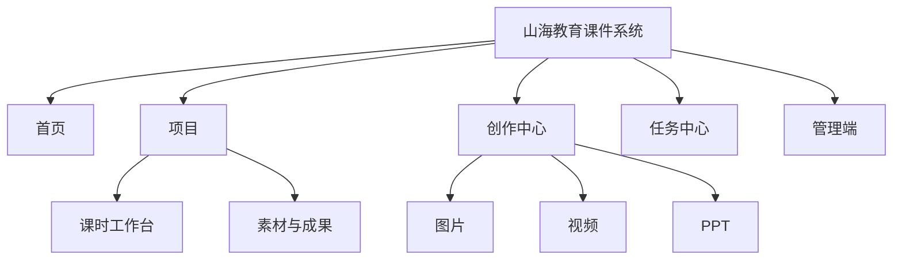

# 信息架构与主页

## 1. 全局导航

桌面端使用64px顶部全局导航，避免项目工作台出现双侧边栏：

```text
山海教育课件系统｜首页｜项目｜创作中心｜任务中心｜搜索｜通知｜头像
```

管理端从头像菜单进入，普通教师不显示无权限入口。



## 2. 主页定位

主页是品牌展示、教师今天的创作起点和成果展厅，不是数据驾驶舱。视觉主题为“山海创作空间”。

### 首屏品牌区

高度约360—420px。左侧展示个性化问候、价值说明和主要操作；右侧展示真实PPT封面、教学插图和视频缩略图组成的成果旅程。

主文案示例：

> 把一份教材，变成完整的课堂作品

主操作：

- 上传教材，创建项目；
- 继续上次创作。

智能创作入口使用“今天想制作什么”，支持上传教材、继续项目、生成图片、图生视频和制作PPT。它是功能入口，不是无边界聊天机器人。

### 继续创作

使用大尺寸项目卡展示当前作品、当前课时、下一件需要完成的事和一个“继续制作”按钮。不得使用密集项目表格。

### 三类创作能力

图片、视频和PPT使用真实作品预览大卡，不使用三个相同图标卡。全局创作中心为一个一级入口，首页提供三个快捷入口。

### 最近成果和待处理

最近成果采用作品集布局；待处理只展示可行动事项，例如教案待确认、封面待选择、镜头失败和交付可下载。

## 3. 新老用户

新用户优先看到上传教材、产品能力和示例成果；老用户优先看到继续创作、等待确认、运行任务和最近成果。共用一个页面，通过数据决定顺序。

## 4. 跳转规则

- 点击全局创作中心：进入创作首页。
- 点击快速生图：直接创建图片创作。
- 从项目去创作：直接进入已导入批次。
- 点击任务通知：进入对应任务项。
- 返回未完成工作：恢复上次批次和选中项。
