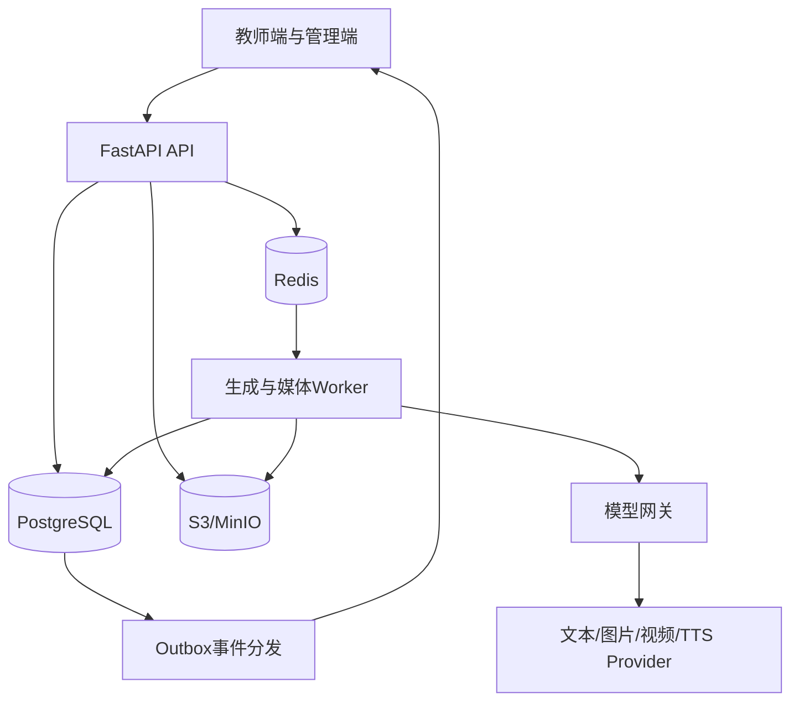

# 山海教育课件系统运行时与后端业务设计规格 V1.0

状态：已确认设计基线  
确认日期：2026-07-17  
适用范围：小学数学第一阶段闭环，架构预留学科、年级、教材版本和工作流扩展  
事实来源级别：产品与运行时设计最高优先级；正式上线后由已合并的数据库迁移、OpenAPI和工作流Schema在各自技术域内继续细化

## 1. 本规格解决什么问题

山海教育课件系统不是多个模型网页的导航器，也不是把Prompt藏在后端的黑盒。它把教师原来手工完成的教材分析、课时划分、教案、PPT、课堂导入视频、图片、视频片段、审核返修和交付统一到一个平台，同时把山海教育已有的Prompt、规则、锚点、模板和工作流真正注入运行时。

系统必须同时满足：

- 用户拥有教学项目，项目拥有完整、可追溯的资产包。
- 图片、视频和PPT创作台是平台级通用能力，可以脱离项目独立使用。
- 项目通过不可变创作包把任务导入创作台，创作台把用户选中的结果保存回指定项目。
- 手动、半自动、全自动使用同一套工作流、数据、任务和资产引擎。
- 所有模型调用前，用户都能看到可编辑的业务Prompt；平台安全约束和结构约束保持只读。
- 每次输入、选择、Prompt、模型参数、输出、审核、费用和版本都有运行证据。
- PPT和视频是已批准教案的两个可选分支，二者互不依赖，也可以全部关闭。

第一阶段不做：整册教材自动切分、在线多人富文本协同、复杂模型竞价、微服务拆分、移动端完整制作、支付结算和面向外部开发者的开放平台。

## 2. 已锁定的架构决策

| 主题 | 决策 |
|---|---|
| 后端形态 | FastAPI模块化单体API＋独立异步Worker；有证据后再拆服务 |
| 数据真源 | PostgreSQL 16；Redis只用于队列、缓存、锁和事件中转 |
| 文件 | S3兼容对象存储，数据库保存元数据、版本、校验和与引用 |
| 前端协议 | REST `/api/v2`＋SSE；OpenAPI 3.1为联调事实来源 |
| 模型调用 | 全部经过服务端模型网关；浏览器不得持有Provider密钥 |
| 内容能力 | Prompt、规则、工作流、锚点、内容结构和模型档案以版本化内容包注入 |
| 版本 | 正式版本不可原地覆盖；草稿可变，保存或生成产生新版本 |
| 创作台 | 平台级通用工具；不与项目长期挂载，不与项目状态实时同步 |
| 项目通信 | 项目创建创作包导入创作台；选中结果通过保存操作回填项目资产位 |
| PPT产物 | 最终PPTX默认采用可编辑混合页面，整页图片只作为预览或明确选择的页面策略 |
| 视频产物 | 一个批准教案可创建一个视频项目；一个母版故事拆为shot，合格clip合成为成片 |

## 3. 系统拓扑与模块边界



模块职责：

- `projects`：项目、课时、分支配置、成员和项目投影状态。
- `materials`：教材上传、验证、解析、页码证据和来源引用。
- `workflows`：定义版本、运行实例、节点状态、推进、暂停、取消和过期传播。
- `artifacts`：业务产物、草稿、正式版本、关系、审核与差异。
- `assets`：文件、文件版本、项目资产位、绑定和下载授权。
- `content_runtime`：内容包、内容结构、运行上下文、Prompt编译和结构校验。
- `creation`：创作包、批次、批次项、生成任务、候选结果和保存回项目。
- `studios`：图片、视频、PPT通用创作入口；只编排creation能力，不复制任务引擎。
- `ppt`：PPT大纲、逐页规格、视觉契约、页面资产、预览和PPTX装配。
- `video`：锚点、母版故事、粗分镜、视觉母图、图片资产、细分镜、shot、clip、音频和合成。
- `model_gateway`：逻辑模型、Provider适配、路由、回退、健康、并发和费用记录。
- `deliveries`：教案、PPTX、视频、清单和最终交付包。
- `admin`：内容包、模型网关、工作流、权限、用量和审计。

模块只能通过应用服务、领域事件和稳定DTO通信，不得跨模块直接修改私有表。API路由只做鉴权、输入校验和应用服务调用；Provider代码不得写进路由或工作流定义。

## 4. 项目、课时与分支

### 4.1 项目边界

一个`Project`代表用户上传的一个小学数学小知识点教材，例如“认识百分数”。项目不是整册教材，也不是单个课时。课时划分确认后，项目包含一个或多个稳定的`LessonUnit`。

每个课时可以配置：

- 教案分支：第一阶段为必选。
- PPT分支：可启用、禁用、跳过或重新开启。
- 视频分支：可启用、禁用、跳过或重新开启。

`disabled`表示该分支不参与当前交付；`skipped`表示本次运行有意跳过但保留运行证据。最终交付只校验已启用分支。

### 4.2 课时划分

输入是教材解析版本和课时划分内容包版本。输出至少包含稳定`lesson_key`、标题、教学内容、目标边界、教材证据、建议时长和先后关系。教师可以增删、排序和修改，批准后才创建或更新正式课时版本。

课时划分只负责“分成几课时和每课时讲什么”，不得在该节点同时生成详细教案。

## 5. 资产、产物和版本模型

### 5.1 三层对象

- `Artifact`：稳定的业务对象，例如第一课时教案、PPT第3页设计稿、视频粗分镜。
- `ArtifactVersion`：不可变的业务版本，保存结构化内容、来源、创建方式和校验结果。
- `FileAsset` / `FileAssetVersion`：PDF、DOCX、PNG、MP4、PPTX等物理文件及其不可变版本。

可编辑中的内容保存在`ArtifactDraft`。自动保存只更新草稿；用户明确保存、模型生成成功或导入成功才创建正式版本。正式版本不允许原地修改。

### 5.2 项目资产包

项目资产包是逻辑聚合，不是一个真实文件夹或ZIP。它由项目内的产物、文件、资产位、绑定和来源关系共同构成。

`ProjectAssetSlot`使用稳定业务键表示目标位置，例如：

- `lesson.01.lesson_plan.current`
- `lesson.01.ppt.page.003.illustration`
- `lesson.01.video.shot.001.keyframe`
- `lesson.01.video.shot.001.clip`
- `lesson.01.delivery.final_video`

`AssetBinding`把某个明确的产物版本或文件版本绑定到资产位。单值资产位同一时刻只能有一个活动绑定；替换时保留旧绑定历史。

### 5.3 来源图谱

`ArtifactRelation`记录`derived_from`、`references`、`uses_style`、`replaces`、`assembled_from`等关系。下游必须引用明确版本ID，不得只复制易失文本。跨项目保存允许发生，但每次都要重新鉴权并保留来源项目、创作批次、任务、Prompt快照、模型参数和操作者。

### 5.4 删除与保留

项目、产物和创作任务默认软删除。删除创作台任务不能删除已经保存到项目的文件版本；归档项目不能破坏创作台历史运行证据。物理文件回收由保留策略和引用计数异步执行。

## 6. 通用创作台、创作包与批量引擎

### 6.1 创作台定位

图片、视频和PPT创作台都是系统的一部分，但不是某个项目节点的附属页面。用户可以：

- 不关联项目，直接输入Prompt和资产进行创作；
- 从项目一键导入系统准备好的创作包；
- 在提交前修改任务项、Prompt、参考图和参数；
- 选择候选结果下载，或保存到任意有写权限的项目。

项目和创作台不保持实时挂载。两者只通过“创作包导入”和“结果保存回项目”通信。

### 6.2 创作包

`CreationPackage`是一次不可变输入快照；进入`ready`后不得修改。它包含来源、目标能力、视觉契约、共享资产、模型偏好、预算、目标资产位和多个`CreationPackageItem`。

图片项通常对应一张教学插图或关键帧；视频项对应一个`shot_id`；PPT项对应一个`page_id`。创作包只描述要做什么，不代表已经提交模型。

### 6.3 批次与候选

导入后创建可编辑的`CreationBatch`和多个`CreationBatchItem`。一个批次在一个页面中展示N张任务卡，不为每张图打开独立创作台。

每次模型提交形成`GenerationJob`，每次Provider尝试形成`GenerationAttempt`，每个返回候选形成`GenerationResult`。技术状态、人工审核状态和保存状态必须分开：

- 技术状态：queued、running、succeeded、failed、cancelled。
- 审核状态：unreviewed、selected、rejected。
- 保存状态：unsaved、saving、saved、save_failed。

批次支持并发、部分成功、单项重试、候选比较和批量选择。图片批次必须引用同一`StyleContract`以维持角色、场景、配色和构图语言一致。

### 6.4 保存回项目

`SaveToProjectOperation`是原子操作：锁定目标资产位，校验用户权限和版本，复制或引用文件版本，创建项目产物版本，建立来源关系，更新资产绑定，写审计与Outbox事件。任何一步失败都整体回滚，不允许页面显示已保存但项目中没有正式资产。

## 7. 工作流模式和状态机

### 7.1 三种模式

- 手动：用户准备输入、编辑Prompt、提交、审核和保存。
- 半自动：系统准备结构、默认选择和Prompt，用户确认后提交和采用结果。
- 全自动：系统在`AutomationPolicy`授权、预算和质量边界内自动提交和推进，遇到必须门禁即暂停。

优先级为节点覆盖课时分支覆盖项目默认。三种模式只改变谁执行动作，不改变底层状态机、数据和任务引擎。

全自动模式可以在策略明确允许、技术校验和质量阈值全部通过、没有强制人工门禁且预算未超限时自动选择候选并调用同一个`SaveToProjectOperation`。系统仍需保存选择依据和完整审计；不满足任一条件时进入`review_required`，不得静默把候选写入项目。

### 7.2 节点状态

`NodeRun`允许的业务状态为：

- `disabled`
- `not_ready`
- `ready`
- `draft`
- `queued`
- `running`
- `review_required`
- `approved`
- `partially_completed`
- `failed`
- `paused`
- `cancel_requested`
- `cancelled`
- `stale`
- `skipped`

节点状态、生成任务状态、结果审核状态和批准状态不得混为一个字段。`pause`阻止新的工作并保留可恢复上下文；`cancel`尽力停止运行中的任务并终结本次运行。Provider不支持取消时要显示“仍可能继续计费”。

### 7.3 过期传播

只有新的上游批准版本会触发下游精确过期；草稿变化不触发。系统根据`node_input_snapshot`和实际引用关系只标记受影响的页、shot或产物为`stale`，不粗暴清空整个分支。用户可以重新生成，也可以明确确认继续使用旧版本，并留下审核记录。

### 7.4 重试和恢复

- Job级：重试一次模型调用。
- Item级：只重试某张图片、某页PPT或某个shot。
- Node级：基于新的输入快照重跑节点。

所有创建、提交、回调、批准和保存操作要求幂等键。Worker使用租约和心跳，重复回调按Provider任务键去重。前端断线不会停止任务。

## 8. 可导入内容包与动态内容结构

### 8.1 内容包类型

系统支持版本化导入：

- Prompt包
- 规则包
- 工作流包
- 锚点包
- PPT工作手册包
- 样式预设包
- 模型档案包
- 输出Schema包
- 内容结构定义包

标准包包含manifest、内容文件、JSON Schema、UI Schema、规则、默认值、示例、测试和校验和。导入包不得包含任意可执行代码；验证器只能引用服务端已经注册的安全实现。

导入流程固定为：隔离解析、安全检查、Schema校验、示例测试、草稿、人工发布。发布版本不可变，按校验和从开发环境提升到测试和生产环境。

### 8.2 动态结构定义

教案十二部分只是系统内置的默认`content_definition_version`，不得写死在数据库列、API DTO或React组件中。管理员可以导入新结构，改变章节、顺序、嵌套、必填级别、生成要求、校验和导出映射。

每个字段至少声明：

- 稳定字段ID、标题、类型和顺序；
- `hard_required`、`soft_required`、`optional`或`disabled`；
- 是否可编辑、可删除、可隐藏、可排序、可由AI生成；
- 长度、数量、数学格式、引用和质量约束；
- Prompt片段、UI提示和DOCX/PDF导出映射。

字段类型支持text、rich_text、number、list、table、group、repeatable、reference、asset、math、rubric和timeline。嵌套默认最多三层，超过时导入校验失败。

前端使用Schema驱动的通用编辑器和注册组件，不允许内容包导入任意React代码。模型结构化输出必须使用稳定字段ID。单个章节或字段可以局部生成和返修。

内容结构同样适用于课时划分、PPT大纲、PPT逐页规格、母版故事、粗细分镜和创作任务项。项目固定引用一个明确版本；升级结构必须预览迁移并创建新的产物版本，不能静默重写历史内容。

## 9. Prompt编译器与运行上下文

### 9.1 ContextBinding白名单

每个节点显式声明允许读取的上下文，不允许把整个项目数据库对象直接塞进模型。运行时解析后形成不可变`RuntimeContext`和`ContextSnapshot`。

锚点选择节点有强制禁止绑定：不得读取教材正文、知识点名称、教案、PPT或课程目标。它只能读取锚点库、视频类型偏好、受众年龄和制作限制。锚点批准后，后续节点才能读取受控`CourseKnowledgeBrief`完成课程适配。

### 9.2 编译顺序

最终请求由固定层次组成：

1. 平台安全与不可覆盖约束。
2. 节点角色和任务边界。
3. 业务规则与内容包要求。
4. 节点输出要求。
5. 已批准的上游版本和允许资产。
6. 教师偏好、教师输入和本次返修意见。
7. 输出Schema和校验要求。
8. Provider适配层。

前端展示“可编辑业务Prompt”，同时摘要展示只读平台约束、输出结构和资产白名单。用户不能删除安全层或输出Schema，但可以修改允许编辑的业务层。

每次提交保存`PromptSnapshot`：模板版本、规则版本、工作流版本、内容结构版本、上下文摘要、资产版本、用户修改、最终Prompt、模型参数和校验和。历史任务必须可重放和审计。

上传的教材和模型返回内容都视为不可信数据，不能通过文本指令覆盖系统规则。上下文编译必须执行Token预算、截断策略和证据引用校验。

### 9.3 输出校验

模型优先输出结构化JSON。系统先做Schema校验，再做硬规则、内容规则和质量规则。可修复的格式错误允许有限次数自动修复；业务内容不合格进入返修，不允许无限自循环调用模型。

## 10. 模型网关

模型网关负责“用哪个Provider执行”，Prompt编译器负责“发送什么业务内容”。两者不得合并。

业务节点只引用逻辑模型，例如：

- `TEXT_REASONING_STANDARD`
- `IMAGE_EDU_CONSISTENT`
- `VIDEO_IMAGE_TO_VIDEO_10S`
- `TTS_CHILD_FRIENDLY`

`ModelProfileVersion`声明能力、输入输出类型、上下文限制、参数Schema和质量等级。`ProviderConfig`声明Base URL、`secret_ref`、并发、限流、超时、价格和健康状态。`ProviderRoute`把逻辑模型映射到主Provider和允许的备用链。

管理端可以导入或创建配置、测试连接、停用模型、设置路由和查看脱敏用量；不能读取密钥明文。失败回退只有在节点策略允许、数据合规一致并且预算未超限时发生，每次实际路由都写入用量记录。

## 11. 教案工作流

```text
教材上传与验证
→ 教材解析和证据确认
→ 仅课时划分
→ 教师确认课时
→ 每课时独立生成教案
→ Schema校验和质量提示
→ 教师编辑、局部返修和批准
```

内置小学数学教案结构默认包含十二部分：教学内容、教材分析、学情分析、设计意图、教学目标、教学重难点及突破策略、教学准备、教学过程、板书设计、课堂总结、分层作业和教学反思。

这十二部分是可替换内容结构包的默认版本，不是程序常量。硬必填项不能无提示删除；软必填项允许确认风险后删除；可选项自由调整。课程导入可以从教案中隐藏或删除，视频分支也可以关闭。

教案批准版本是PPT和视频分支的业务入口，但视频锚点选择仍执行隔离规则，不受教案内容影响。

## 12. PPT内部工作流

```text
已批准教案
→ PPT大纲
→ 逐页规格
→ 封面生成与批准
→ PptStyleContract
→ 正文页面资产
→ 页面预览与逐页批准
→ PPTX装配
→ 最终审核与交付
```

### 12.1 大纲和逐页规格

大纲中的每页拥有稳定`page_id`，支持增删、排序和修改。逐页规格描述教学目的、页面类型、可编辑文字、数学对象、布局块、视觉资产、师生活动和逐步呈现建议。

### 12.2 封面和视觉契约

先单独生成并批准封面。批准封面编译为`PptStyleContract`，包含配色、字体气质、标题层级、插画语言、图形语法和禁止项。正文默认纯白背景，但沿用封面的配色、角色和图形语言。

### 12.3 正文和PPTX

每页需要的插图通过图片创作批次生成。页面预览可以是PNG，但最终PPTX默认是混合可编辑结构：标题、正文、数学公式、数据、图表、题目和关键标签使用可编辑文本或形状；AI图片作为独立资产置入。不得把需要课堂修改的数学内容烘焙进整页图片。

PPTX装配通过可替换Renderer Adapter实现，第一阶段可以采用PptxGenJS或python-pptx实现之一，接口不得绑定特定云厂商。

强制审核门禁是大纲、封面和最终PPTX；页面可以按策略逐页审核或批量审核。单页修改只使该页预览和下游PPTX版本过期。

## 13. 课堂导入视频内部工作流

```text
三类九套锚点候选
→ 锚点与主题批准
→ 课程知识受控适配
→ 完整母版故事
→ 粗分镜
→ 视觉母图与VideoStyleContract
→ 图片资产
→ 细分镜和视频Prompt
→ 每个shot生成候选片段
→ 选中并保存合格clip
→ TTS/音乐/字幕
→ FFmpeg合成与技术校验
→ 最终审核与交付
```

### 13.1 三类九套与锚点

内置三类是科普类、应用类和故事类，每类默认三套。独立创意不是“必须制造冲突”，而是为视频确定表达机制：科普类以现象、未知或认知惊奇作为锚点；应用类以真实任务、选择或解决需要作为锚点；故事类以人物目标、阻碍、变化或悬念作为锚点。

锚点生成阶段不读取知识点和教案。锚点批准后，系统才使用`CourseKnowledgeBrief`把课程知识嵌入故事。课程知识服务于锚点确定的表达，不反向改写锚点的核心机制。

### 13.2 母版故事、粗分镜与视觉母图

一份批准教案创建一个视频项目，一个视频项目先形成一份完整母版故事。母版故事通过后拆成粗分镜节拍；粗分镜只描述每段发生什么，不是模型Prompt。

根据故事和粗分镜制作一张或一组视觉母图，确认角色、场景、材质、光线、配色和画幅，并编译`VideoStyleContract`。随后才批量生成各镜头需要的关键帧或资产图。

### 13.3 细分镜、shot与clip

细分镜拥有稳定`shot_id`，绑定已批准图片、动作、镜头运动、时长、画幅、声音意图和视频模型Prompt。Provider能力适配可以改变请求格式，但不能改变shot业务语义。

模型返回的只是候选视频。只有候选通过技术校验、被用户或自动策略选中，并成功保存到项目`shot`资产位后，才分配正式`clip_id`。一个shot可以有多个历史clip，但同一交付版本只有一个当前选中clip。

单个shot失败只重试该shot。第一阶段建议视频模型生成无对白画面，旁白和对白由TTS生成，音乐和字幕独立管理，再由FFmpeg合成。合成前校验分辨率、帧率、编解码、时长、音轨、黑帧和缺失片段。

强制审核门禁是锚点与主题、母版故事、视觉母图/视觉契约和最终视频。

## 14. 数据库设计

### 14.1 通用约定

使用PostgreSQL 16、SQLAlchemy 2和Alembic。主键使用UUIDv7；时间使用`timestamptz`；可编辑聚合使用`lock_version`；删除使用`deleted_at`。结构化动态内容存JSONB，稳定关系、权限、状态和唯一性使用规范化列。Redis和对象存储都不是业务状态真源。

### 14.2 核心表

| 分组 | 表 |
|---|---|
| 身份权限 | `users`、`organizations`、`organization_members`、`project_members` |
| 项目教材 | `projects`、`lesson_units`、`lesson_branch_configs`、`source_materials`、`material_parse_versions` |
| 内容控制面 | `content_packages`、`content_package_versions`、`content_package_files`、`content_releases`、`content_release_items`、`content_definition_versions` |
| 工作流 | `workflow_definitions`、`workflow_definition_versions`、`workflow_runs`、`branch_runs`、`node_runs`、`node_input_snapshots`、`automation_policies` |
| 产物资产 | `artifacts`、`artifact_drafts`、`artifact_versions`、`file_assets`、`file_asset_versions`、`project_asset_slots`、`asset_bindings`、`artifact_relations` |
| Prompt审核 | `context_snapshots`、`prompt_snapshots`、`approvals` |
| 创作执行 | `creation_packages`、`creation_package_items`、`creation_batches`、`creation_batch_items`、`creation_batch_item_revisions`、`generation_jobs`、`generation_attempts`、`generation_results`、`save_to_project_operations` |
| PPT | `ppt_documents`、`ppt_pages`、`ppt_style_contracts`、`ppt_render_versions` |
| 视频 | `video_projects`、`storyboard_beats`、`video_style_contracts`、`video_shots`、`video_clips`、`audio_segments`、`video_assemblies` |
| 模型 | `model_profiles`、`model_profile_versions`、`provider_configs`、`provider_routes`、`usage_records` |
| 可靠性 | `idempotency_records`、`domain_events`、`outbox_events`、`audit_logs` |

### 14.3 关键约束

- `lesson_key`在项目内唯一且稳定。
- 页面和课时排序唯一约束采用可延迟事务约束，支持安全重排。
- 同一项目、分支和工作流版本只允许一个活动运行。
- `Artifact`的业务逻辑键在项目内唯一；`ArtifactVersion.version_no`单调递增。
- 已发布内容包、Prompt快照、上下文快照、正式产物版本和文件版本不可更新。
- 单值资产位只允许一个活动绑定。
- 幂等键在用户、动作和有效窗口范围唯一。
- Provider任务ID和回调事件ID必须唯一。
- 任何外键删除不得跨越资产版本做大范围级联删除。

### 14.4 关键事务

保存创作结果、批准产物并传播过期、发布内容包必须分别在单个数据库事务中完成。保存结果时锁目标资产位；批准时锁当前产物和受影响节点；发布内容包时校验依赖图和校验和后一次性切换发布状态。

## 15. API、SSE与文件合同

### 15.1 API规范

新接口统一位于`/api/v2`。成功响应：

```json
{
  "data": {},
  "meta": {},
  "request_id": "req_01"
}
```

失败响应：

```json
{
  "error": {
    "code": "ARTIFACT_VERSION_CONFLICT",
    "message": "当前内容已被其他操作更新",
    "retryable": false,
    "details": {}
  },
  "request_id": "req_01"
}
```

异步任务返回`202 Accepted`、`job_id`、状态、订阅地址和任务摘要。主要资源域为`projects`、`materials`、`artifacts`、`assets`、`workflow-runs`、`approvals`、`prompts`、`creation-packages`、`creation-batches`、`studios`、`content-packages`、`model-gateway`、`usage`、`deliveries`和`events`。

列表接口使用游标分页。可编辑资源返回`ETag`或`lock_version`，更新必须带`If-Match`。创建、生成、重试、批准和保存类动作必须带`Idempotency-Key`。

### 15.2 SSE

支持：

- `GET /api/v2/events/stream`
- `GET /api/v2/projects/{project_id}/events/stream`
- `GET /api/v2/jobs/{job_id}/events/stream`

事件包含`event_id`、`event_type`、`project_id`、`node_run_id`、`job_id`、`status`、`progress`、`message`、`occurred_at`和最小安全`data`。支持`Last-Event-ID`、心跳、断线续传和鉴权。SSE只通知前端刷新目标Query，不携带完整业务对象，也不包含密钥、完整教材或完整Prompt。

事件分类为`workflow.node.*`、`generation.job.*`、`creation.batch.*`、`artifact.*`、`asset.*`、`ppt.*`、`video.*`、`delivery.*`和`system.notification`。数据库Outbox是可靠事件来源。

### 15.3 文件

前端先申请预签名地址，再直传对象存储，最后调用完成接口。文件经过扩展名、MIME、魔数、大小、SHA-256和安全检查后才从`uploaded`进入`ready`；失败进入`rejected`。教材解析、缩略图和媒体探测由Worker执行。下载使用短期签名URL并在每次授权时重新检查权限。

## 16. 权限、安全与审计

### 16.1 权限

项目角色：Owner、Editor、Reviewer、Viewer。平台管理角色独立设置为内容包管理员、工作流管理员、模型网关管理员、成本审计员和系统管理员。

创作台属于用户级功能；用户可以操作自己的创作任务。读取项目创作包需要项目读取权限，保存回项目需要项目写权限，批准产物需要Reviewer或更高权限。跨项目保存逐次校验。

### 16.2 安全

- Provider密钥只保存为`secret_ref`，永不返回浏览器。
- 会话使用HttpOnly、Secure、SameSite Cookie和CSRF防护；CORS使用明确白名单。
- 外部Base URL和回调地址执行SSRF防护。
- 上传验证真实文件类型；生产环境接入恶意文件扫描。
- 用户内容和模型输出不得作为可信HTML执行。
- 内容包禁止任意代码、远程引用和未注册验证器。
- 日志不记录密钥、完整敏感教材、完整用户Prompt或对象存储私有地址。
- 所有对象查询在后端执行用户、组织和项目隔离，不能依赖前端隐藏。
- Provider回调必须验签、去重并限制来源。

### 16.3 审计

内容包发布、工作流切换、模型路由修改、Prompt人工修改、批准驳回、自动化策略修改、生成重试取消、跨项目保存、资产替换删除下载和最终交付都写入`audit_logs`。记录操作者、对象、动作、前后摘要、请求ID、时间和来源；敏感字段只保存摘要。

## 17. 可靠性、成本与可观测性

每次HTTP请求、工作流节点、生成任务、Provider尝试和资产保存共享可关联的trace ID。记录队列等待、模型耗时、失败分类、Token、图片数量、视频秒数、估算和最终费用。

预算可以设置在组织、用户、项目、分支、节点和单次任务层。预算预估超限时不提交Provider；Provider实际费用超出预估时记录偏差并触发告警，不回滚已经完成的资产。

Worker队列至少分为text、image、video、tts、media和export，分别配置并发、超时和重试。视频和FFmpeg任务不能占用文本任务Worker。

核心告警包括任务积压、回调失败、Provider错误率、SSE分发延迟、Outbox积压、对象存储失败、费用异常和数据库连接耗尽。

## 18. 前后端契约与动态渲染

后端生成的OpenAPI是接口唯一事实来源，前端自动生成TypeScript类型和API客户端。工作流节点、内容结构和状态枚举由后端合同驱动；前端不能复制一套自定义状态机。

教案、PPT页面、故事和分镜采用`content_definition_version + ui_schema + data`渲染。前端使用注册表选择安全组件；遇到未知字段类型显示明确的不兼容错误，不能静默丢字段。

外包前端可以使用MSW和需求草案开发，但真实联调必须以正式OpenAPI和SSE Schema为准。所有破坏性合同变更需要迁移说明和合同测试。

## 19. 验收策略

### 19.1 合同与单元测试

- 内容包导入、依赖、Schema、校验和和禁止代码测试。
- Prompt编译顺序、ContextBinding白名单和锚点隔离测试。
- 工作流状态迁移、暂停取消、精确过期和幂等测试。
- 资产位唯一绑定、跨项目鉴权和保存原子性测试。
- 模型路由、回退、回调去重和费用记录测试。

### 19.2 集成测试

- PostgreSQL事务、乐观锁和Outbox投递。
- S3预签名上传、验证、下载授权和保留策略。
- Worker失败恢复、部分成功和单项重试。
- PPTX装配后可打开、页数正确、正文白底、关键内容可编辑。
- 视频片段技术校验、音轨、字幕和FFmpeg合成。

### 19.3 端到端闭环

使用固定真实小学数学知识点完成：教材上传、课时划分、动态Schema教案、只做教案、教案＋PPT、教案＋视频、全部分支、手动、半自动、全自动暂停、项目导入创作台、创作台独立生成、保存回其他有权限项目、刷新恢复、失败重试和最终交付。

不得用占位图片、静态Mock任务或不可编辑整页截图冒充真实闭环。

## 20. 旧基座迁移边界

复用`DOIT-Ben/shanhaiedu-v1.0.0`中的FastAPI应用骨架、认证思路、状态机经验、任务和产物抽象、Prompt registry及Provider adapter。迁移时必须适配本规格的新领域模型，不能直接把旧SQLite表和旧状态枚举当作正式合同。

SQLite只保留为单元测试适配器；生产数据进入PostgreSQL。旧本地文件迁移到对象存储。旧API保留在`/api/v1`过渡，新实现使用`/api/v2`。

迁移顺序：平台基座与身份、项目教材和课时、动态教案、内容运行时与模型网关、通用创作引擎、PPT、视频、交付和治理。具体任务拆分在本规格经用户书面审核后另行形成实施计划。

## 21. 设计完成定义

本规格已经明确：领域边界、资产与版本、创作台通信、批量任务、自动化状态机、动态内容包、Prompt编译、模型网关、教案/PPT/视频工作流、数据库表族、事务约束、API、SSE、权限、安全、审计、可靠性、测试和迁移边界。

任何后续设计或实现如果改变下列内容，必须形成ADR并取得产品确认：项目边界、创作台非挂载关系、锚点隔离、动态内容结构、版本不可变、Prompt可见可编辑、PPT可编辑混合产物、clip正式化条件以及三种模式共用同一引擎。
