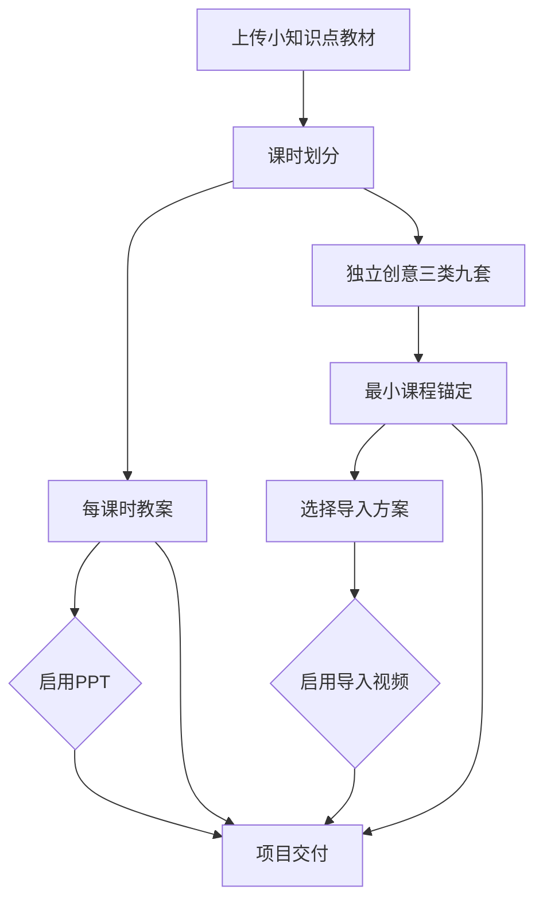

# 端到端业务工作流

状态：当前唯一业务流程定义

## 1. 总流程



教案正文和课堂导入设计是课时划分后的兄弟产物。三类九套默认作为教案正文之后的独立附录展示，但两者状态、版本和审核互不阻塞。PPT依赖已批准教案；视频依赖已选择导入方案，不读取教案正文。PPT与视频互不依赖。

### 节点配置边界

整个流程由四层事实共同运行，不能由业务模块临时拼接：

1. 工作流图只定义节点、依赖、课时分支和推进顺序。
2. `GenerationTemplate`定义一个模型能力如何组合输入、业务Prompt、结构化输出和投影。
3. `WorkflowNodeGenerationBinding`把节点绑定到模型生成、确定性执行或人工门禁，并显式声明规范资料、Context、参考资产、校验修复和审核策略。
4. `PromptSnapshot`、`ContextSnapshot`和运行输入快照保存某次执行真正使用的不可变事实。

“参考”分为三类，不能混用：

- handbook、rule_set、anchor_library和style_preset等规范随内容发布固定，只在服务端参与Prompt编译；
- 教材证据、批准课时、教案、教师偏好和上游产物属于结构化Context，节点默认禁止，显式声明后才能读取；
- 图片、视频、音频和文档版本属于多模态参考资产，策略必须为`none`、`optional`或`required`，并限制角色、类型、数量、顺序、来源和Provider暴露方式。

老师在前端只看到并修改一段完整业务生成要求。内部模板、输出字段结构、JSON Schema、校验修复和Provider格式不向老师展示；提示词修改不能改变教案十段/十二段等内容结构，结构变化由管理员发布新版模板。

当前脱敏节点目录合同覆盖教材、课时、教案、三类九套、PPT、图片、视频、TTS、装配和交付。它固定业务阶段与权限边界，不固定供应商模型名或私有参数。

## 2. 教材、课时和教案

```text
教材上传
→ 文件验证
→ 教材解析和页码证据
→ 教师确认教材范围
→ 仅生成课时划分
→ 教师增删、排序和批准课时
→ 每课时独立生成教案
→ 字段和质量校验
→ 教师编辑、局部返修和批准
```

课时划分只决定分几课时和每课时讲什么，不同时生成详细教案。教案按项目固定的内容定义版本生成。

每课时默认同时生成三类九套导入设计：先在无课程上下文中生成九个独立创意，再只为每个创意补充一个最小课程锚点和推荐度。最终方案集作为独立附录产物；教师可以稍后选择，不阻塞教案和 PPT。

## 3. PPT流程

```text
已批准教案
→ PPT大纲
→ 逐页规格
→ 封面生成与批准
→ 整套PPT风格
→ 正文所需图片资产
→ 正文页面预览与编辑
→ PPTX装配
→ 最终审核与交付
```

规则：

- 每页拥有稳定`page_id`。
- 封面先确认，正文默认纯白背景并继承封面视觉语言。
- 整页图片可以作为预览，但最终PPTX默认采用可编辑混合结构。
- 标题、正文、公式、数据、图表、题目和关键标签不得烘焙进AI图片。
- 单页修改只使该页预览和当前PPTX版本过期。
- 强制审核门禁为大纲、封面和最终PPTX。

## 4. 课堂导入视频流程

```text
三类九套独立创意
→ 最小课程锚定与推荐度
→ 教师选择一个导入方案
→ 完整母版剧本
→ 粗分镜
→ 视觉母图和视频画面风格
→ 镜头图片资产
→ 细分镜和视频生成指令
→ 每个shot生成候选视频
→ 选择并保存合格clip
→ TTS、音乐和字幕
→ FFmpeg合成与技术校验
→ 最终审核与交付
```

一个批准课时可以创建导入方案集，不要求教案先批准。教师选定后，视频项目只接收被选方案的完整不可变快照，不再读取教案、教材或其他未声明课程上下文。

母版剧本是一份完整可读的故事与生产文本，包含场次、画面动作、旁白、对白、声音意图、课堂首问和交接时刻，但不包含 shot 级模型提示词。一个视频项目只有一条当前批准母版剧本，再由它拆出粗分镜；粗分镜只描述场次节拍、预计时长和资产需求，不是视频生成指令。

视觉母图在粗分镜之后，用于确定角色、场景、材质、光线、配色和画幅。图片资产批准后才生成细分镜。

粗分镜与母版剧本共同产生最终资产清单。人物、场景、道具和生物分别登记并单独生成；场景默认无人物，道具默认单体。视觉母图负责锁定风格，不替代各资产图片。细分镜按 shot 引用已批准图片，明确每张垫图的位置、动作、镜头、时长、旁白/声音占位和连续性。

一个`shot_id`默认适配 10 秒或 15 秒生成规格，可以有多个候选视频。候选只有通过技术校验、被选中并成功保存到项目镜头资产位后，才创建正式`clip_id`。一个交付版本每个shot只有一个当前clip。

第一阶段建议模型生成无对白画面，声音由TTS和音频流程独立生成，再统一合成。

## 5. 通用创作流程

项目模式：

```text
批准的上游内容
→ 编译CreationPackage
→ 导入可编辑CreationBatch
→ 批量提交GenerationJob
→ 候选GenerationResult
→ 用户或授权策略选择
→ SaveToProjectOperation
→ 项目当前作品和素材
```

独立模式：

```text
用户进入创作中心
→ 输入生成要求和参考素材
→ 生成候选
→ 下载或选择项目保存
```

全自动模式只有在策略允许、质量阈值通过、没有人工门禁且预算充足时自动选择和保存，否则进入等待确认。

## 6. 修改和过期

草稿修改不影响下游。新的上游批准版本产生后，根据实际输入快照和引用关系精确标记受影响内容为过期。用户可以重新生成，也可以明确选择继续使用旧版本并留下记录。

重试分为：

- Job重试：同一输入重新调用模型；
- Item重试：只重试一张图、一页PPT或一个镜头；
- Node重跑：基于新输入快照重新执行整个步骤。

## 7. 交付

项目交付只包含已启用分支的当前批准版本：

- 教案DOCX/PDF；
- PPTX和预览；
- 完整课堂视频、字幕和必要音频；
- 质量报告和文件清单。

中间候选、失败结果和未保存创作结果不进入交付包。
