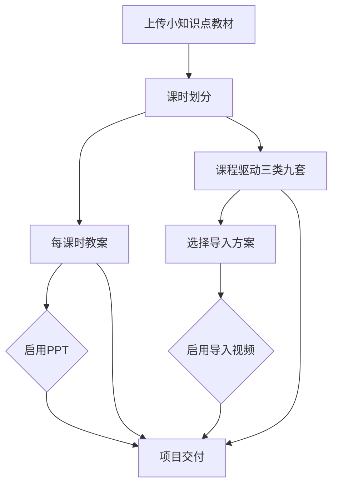

# 端到端业务工作流

状态：当前唯一业务流程定义

## 1. 总流程



上图是业务分支概览，不是完整可执行节点图。#130与PR #141已经把`WorkflowNodeGenerationBinding v2`候选拓扑合入主线，#146继续加固其发布和运行时安全边界；只有#146合并并通过PostgreSQL前向发布复验后，运行时才把对应`graph_json`作为新项目默认。`dependencies`只表达同`execution_scope/branch_key`内的直接生产者，跨组事实通过输入合同和Context白名单解析。

教案正文和课堂导入设计是课时划分后的兄弟产物。三类九套默认作为教案正文之后的独立附录展示，但两者状态、版本和审核互不阻塞。PPT依赖已批准教案；视频依赖已选择导入方案，不读取教案正文。PPT与视频互不依赖。

### 节点配置边界

整个流程由四层事实共同运行，不能由业务模块临时拼接：

1. 工作流图只定义节点、依赖、课时分支和推进顺序。
2. `GenerationTemplate`定义一个模型能力如何组合输入、业务Prompt、结构化输出和投影。
3. `WorkflowNodeGenerationBinding`把节点绑定到模型生成、确定性执行或人工门禁，并显式声明规范资料、Context、参考资产、校验修复和审核策略。
4. `PromptSnapshot`、`ContextSnapshot`和运行输入快照保存某次执行真正使用的不可变事实。

“参考”分为三类，不能混用：

- handbook、rule_set、anchor_library和style_preset等规范随内容发布固定，只在服务端参与Prompt编译；
- 教材证据、批准课时、教案、教师偏好和上游产物属于结构化Context，节点默认禁止，显式声明后才能读取；
- 图片、视频、音频和文档版本属于多模态参考资产，策略必须为`none`、`optional`或`required`，并限制角色、类型、数量、顺序、来源和Provider暴露方式。

老师在前端只看到并修改一段完整业务生成要求。内部模板、输出字段结构、JSON Schema、校验修复和Provider格式不向老师展示；提示词修改不能改变教案十段/十二段等内容结构，结构变化由管理员发布新版模板。

当前脱敏节点目录合同覆盖教材、课时、教案、三类九套、PPT、图片、视频、TTS、装配和交付。它固定业务阶段与权限边界，不固定供应商模型名或私有参数。

### 首套内置生成基线

`shanhai.primary_math.courseware@1.1.0`是#130建立、#146加固并由#116补齐Intro exact来源/独立批准/选择边界的前向候选；显式PostgreSQL发布前，当前正式发布基线仍是`1.0.0`，既有项目绑定不改写。候选声明源位于`workflow/builtin/primary_math_courseware/generation-source.json`，确定性构建后为48节点目录中的22个`model_generation`节点各提供：

- 教师输入、系统补全和Context注入字段；
- 可编辑业务Prompt与只读方法、质量门；
- 结构化输出字段、必填/可编辑/可删/重复语义；
- 教师可读投影和GenerationTemplate引用；
- 逻辑模型能力和风格预设，不含Provider名称、密钥或私有参数。

每个`model_generation`节点还声明不可变Artifact输出投影；未声明`creation_package`的模型节点只形成Artifact，声明该投影的模型节点在Artifact版本落库取得版本ID后再形成CreationPackage。13个`deterministic`节点和12个`human_gate`节点不属于这条模型输出投影编译路径；其中`delivery.package`等确定性节点仍由各自平台执行器负责。#89已经实现通用模型节点的确定性Fake执行、恢复和原子写回，但不代表真实Provider、媒体Adapter或业务validator已经实现。

旧v1 Release继续固定原有工作流语义；仅当调用方要求消费其未声明的v2输出投影时，才以`WORKFLOW_RELEASE_UNSUPPORTED`拒绝，不能把该错误扩大为旧工作流整体不可启动。

“1～5的认识”黄金项目只提交教材哈希、物理页3～5与印刷页14～16映射、脱敏证据和结构期望。它验证教案、PPT和视频可从各自固定输入独立启动，并明确禁止视频读取教案、教材和PPT。普通CI据此使用确定性Fixture；真实文本、图片和视频调用仍必须在对应适配器任务及阶段出口单独冒烟，不能用内容包通过替代。TTS仅保留未来音频计划数据，待音频Provider可用后独立验收。

### 执行方式边界

完整课件只有一个`WorkflowDefinition`。用户侧提供两种执行方式：

- `automatic`：自动运行策略允许的节点，只在人工必审、预算、质量、安全或失败门禁暂停；
- `guided`：主要节点产生结果后暂停，教师可编辑、确认并继续。

两者共享同一个项目、`WorkflowRun`、`NodeRun`、产物版本、任务、依赖、质量门禁和资产槽位。节点级自动启动、采用、写回和审核由不可变`AutomationPolicy`快照控制；任意组合的暂停策略不形成第三套工作流或第三种领域模式。

## 2. 教材、课时和教案

```text
教材上传
→ 文件验证
→ 教材解析和页码证据
→ 教师确认教材范围
→ 仅生成课时划分
→ 教师增删、排序和批准课时
→ 每课时独立生成教案
→ 字段和质量校验
→ 教师编辑、局部返修和批准
```

课时划分只决定分几课时和每课时讲什么，不同时生成详细教案。教案按项目固定的内容定义版本生成。

每个`lesson_plan.generate`只运行在一个active LessonUnit分支。模型调用前，运行时从当前批准课时划分中只投影目标`lesson_unit_key`，并冻结该划分版本、唯一正式教材解析、批准`material_scope`和可选教师偏好；其他课时、完整方案集、PPT和视频不能进入Context。生成结果由项目固定ContentDefinition校验十二部分Schema，再结合exact课时、教材证据、知识边界、目标-评价引用和总时长形成不可变QualityReport。

教师退回后，服务器从exact生成版本建立受#131策略约束的baseline draft；合法字段编辑提交为新的不可变ArtifactVersion，锁定字段不能通过用户或system actor绕过。旧版本的passing报告和人工gate不能批准新版本；每次返修必须创建更高`run_no`的validate与approval gate并重新校验。`request_changes`永久退休当前exact gate；批准时Artifact指针、Approval、gate终态、stale传播和事件在一个事务提交。一个课时的失败、返修、批准或stale不读取或改写其他LessonUnit。

每课时默认同时生成三类九套导入设计：单个节点读取批准课时、知识点、学习目标、内容边界、不得提前讲授、年级/年龄、教材证据摘要和可选教师偏好，一次生成最终九套方案。三种主要倾向各三套并允许辅助倾向交叉；方案集作为独立附录产物，教师可以稍后选择，不阻塞教案和PPT。

## 3. PPT流程

```text
已批准教案
→ PPT大纲
→ 逐页规格
→ 封面生成与批准
→ 整套PPT风格
→ 正文所需图片资产
→ 正文页面预览与编辑
→ PPTX装配
→ 最终审核与交付
```

规则：

- 每页拥有稳定`page_id`。
- 封面先确认，正文默认纯白背景并继承封面视觉语言。
- 整页图片可以作为预览，但最终PPTX默认采用可编辑混合结构。
- 标题、正文、公式、数据、图表、题目和关键标签不得烘焙进AI图片。
- 单页修改只使该页预览和当前PPTX版本过期。
- 强制审核门禁为大纲、封面和最终PPTX。

## 4. 课堂导入视频流程

```text
课程驱动三类九套与推荐度
→ 教师选择一个导入方案
→ 完整母版剧本
→ 粗分镜
→ 视觉母图和视频画面风格
→ 镜头图片资产
→ 细分镜和视频生成指令
→ 每个shot生成候选视频
→ 选择并保存合格clip
→ TTS、音乐和字幕
→ FFmpeg合成与技术校验
→ 最终审核与交付
```

一个批准课时可以创建导入方案集，不要求教案先批准。教师选定后，视频项目只接收被选方案的完整不可变快照，不再读取教案、教材或其他未声明课程上下文。

母版剧本是一份完整可读的故事与生产文本，包含场次、画面动作、旁白、对白、声音意图、课堂首问和交接时刻，但不包含 shot 级模型提示词。一个视频项目只有一条当前批准母版剧本，再由它拆出粗分镜；粗分镜只描述场次节拍、预计时长和资产需求，不是视频生成指令。

视觉母图在粗分镜之后，用于确定角色、场景、材质、光线、配色和画幅。图片资产批准后才生成细分镜。

粗分镜与母版剧本共同产生最终资产清单。人物、场景、道具和生物分别登记并单独生成；场景默认无人物，道具默认单体。视觉母图负责锁定风格，不替代各资产图片。细分镜按 shot 引用已批准图片，明确每张垫图的位置、动作、镜头、时长、旁白/声音占位和连续性。

一个`shot_id`当前适配6至30秒逻辑生成能力，可以有多个候选视频。候选只有通过技术校验、被选中并成功保存到项目镜头资产位后，才创建正式`clip_id`。一个交付版本每个shot只有一个当前clip。

第一阶段建议模型生成无对白画面，先保存旁白、对白、声音意图、字幕和时间线计划；TTS Provider与真实配音生成后续独立实现，再统一合成。

## 5. 通用创作流程

项目模式：

```text
WorkflowRun / NodeRun中的批准上游内容
→ 编译包含来源与固定目标槽位的不可变CreationPackage
→ 导入project来源的CreationBatch / CreationItem
→ 保存业务Prompt版本并冻结本次PromptSnapshot
→ 批量提交GenerationJob
→ 产生Candidate
→ 用户或授权策略Adopt候选
→ 幂等执行SaveToProjectOperation
→ AssetBinding更新并解锁下游或传播stale
```

项目批次必须携带`project_id`、`workflow_run_id`、`source_node_run_id`、`creation_package_id`和`target_slot`。目标来自创作包，普通生成或写回请求不能改成其他项目或槽位；需要跨项目复用时先转为独立资产，再执行显式鉴权的附加操作。

独立模式：

```text
用户进入创作中心
→ 输入生成要求和参考素材
→ 保存业务Prompt版本
→ 生成并采用候选
→ 下载或保存到个人资料
→ 可选：显式选择有权限项目与槽位并写回
```

独立批次不伪造项目、工作流或节点来源。`save_prompt_version`、`generate`、`adopt`和`save_to_project`是四个独立命令：采用不等于写回，保存Prompt版本不触发生成，写回必须重新鉴权并保留完整血缘。

`automatic`只有在策略允许、质量阈值通过、没有人工门禁且预算充足时自动采用和写回，否则进入等待确认；`guided`在主要节点结果形成后等待教师确认。

## 6. 修改和过期

草稿修改不影响下游。新的上游批准版本产生后，根据实际输入快照和引用关系精确标记受影响内容为过期。用户可以重新生成，也可以明确选择继续使用旧版本并留下记录。

重试分为：

- Job重试：同一输入重新调用模型；
- Item重试：只重试一张图、一页PPT或一个镜头；
- Node重跑：基于新输入快照重新执行整个步骤。

## 7. 交付

项目交付只包含已启用分支的当前批准版本：

- 教案DOCX/PDF；
- PPTX和预览；
- 完整课堂视频、字幕和必要音频；
- 质量报告和文件清单。

中间候选、失败结果和未保存创作结果不进入交付包。
